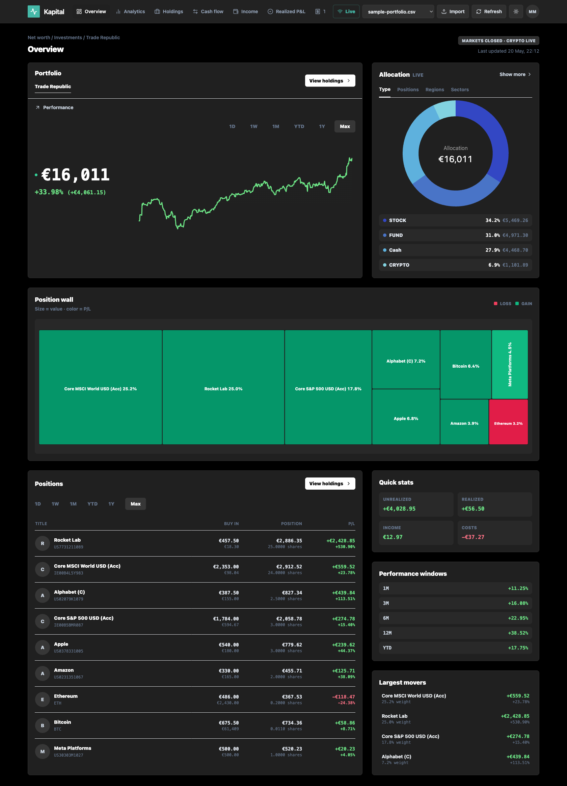
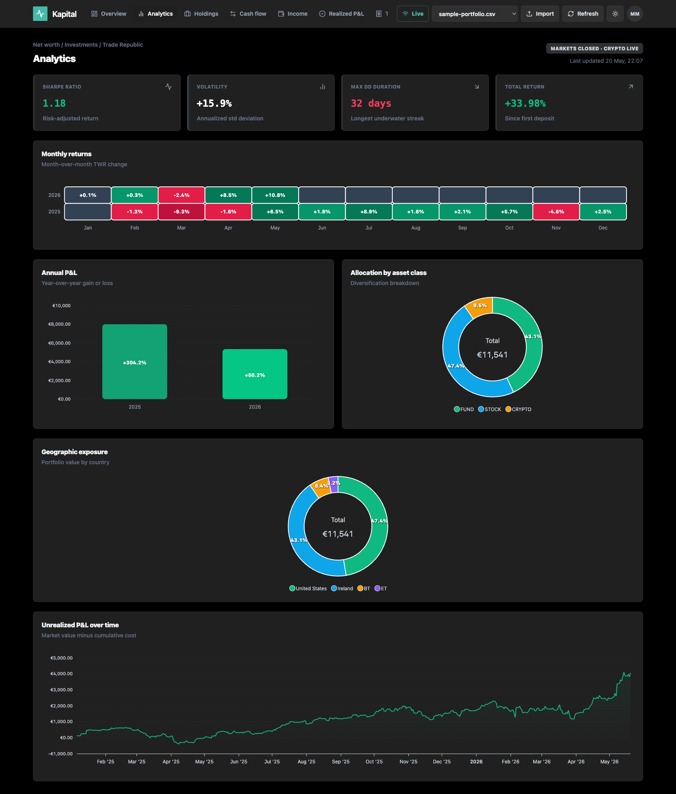
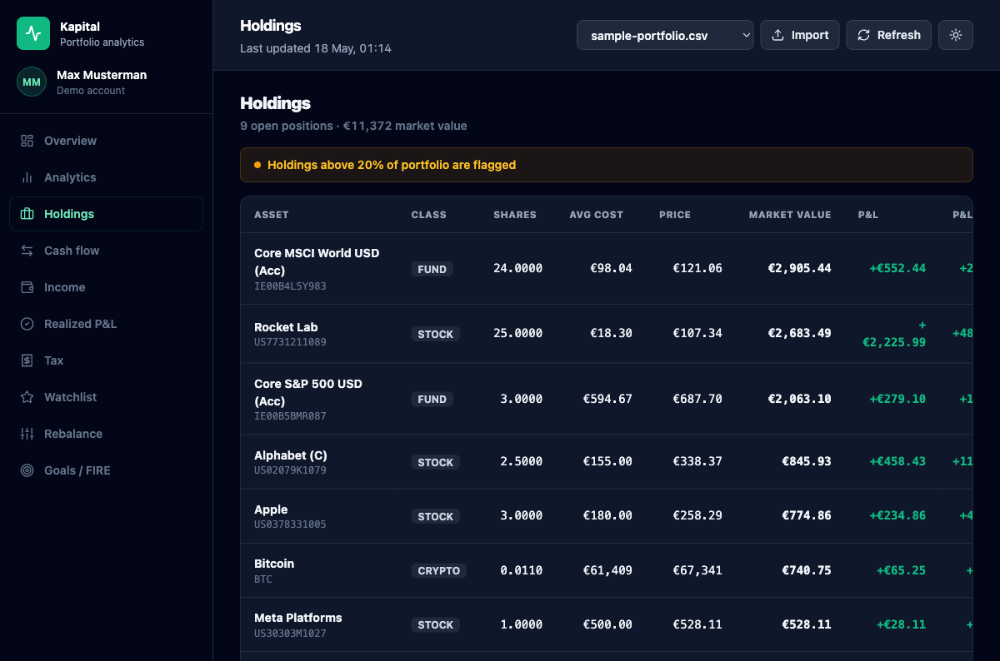
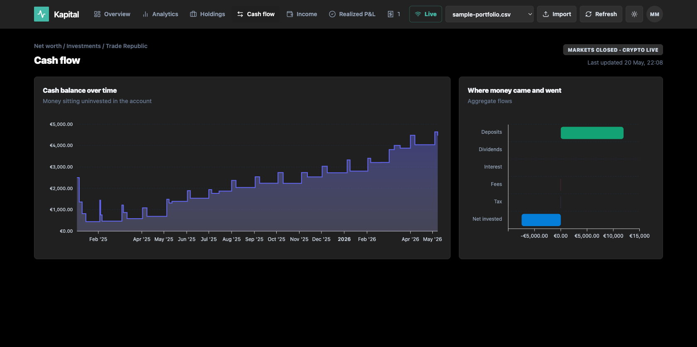
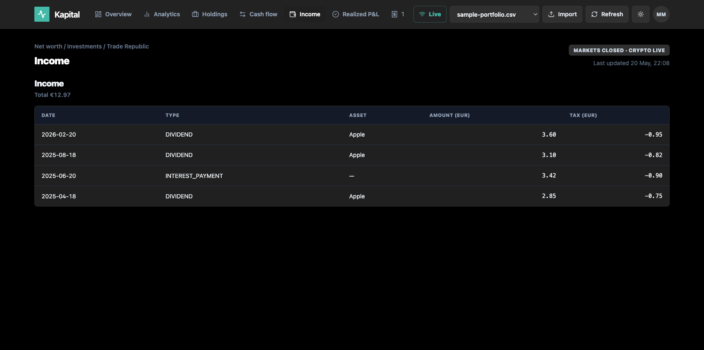
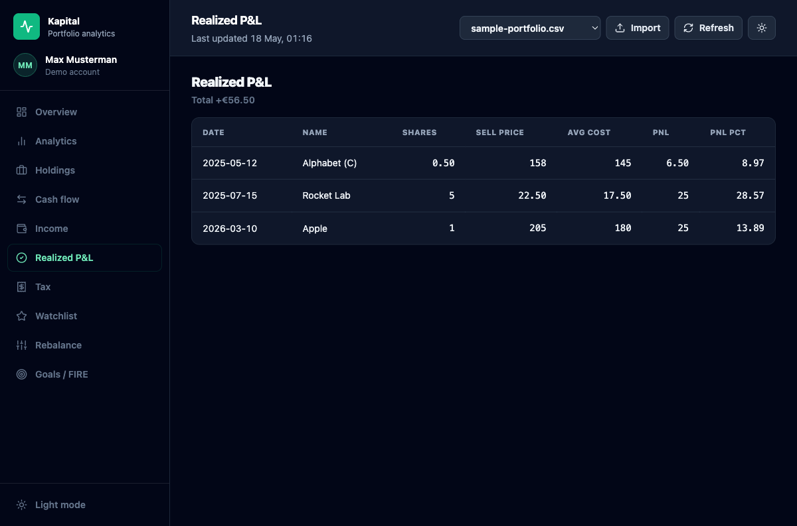
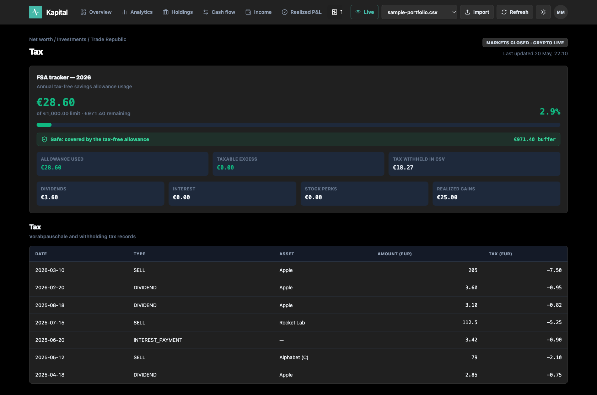
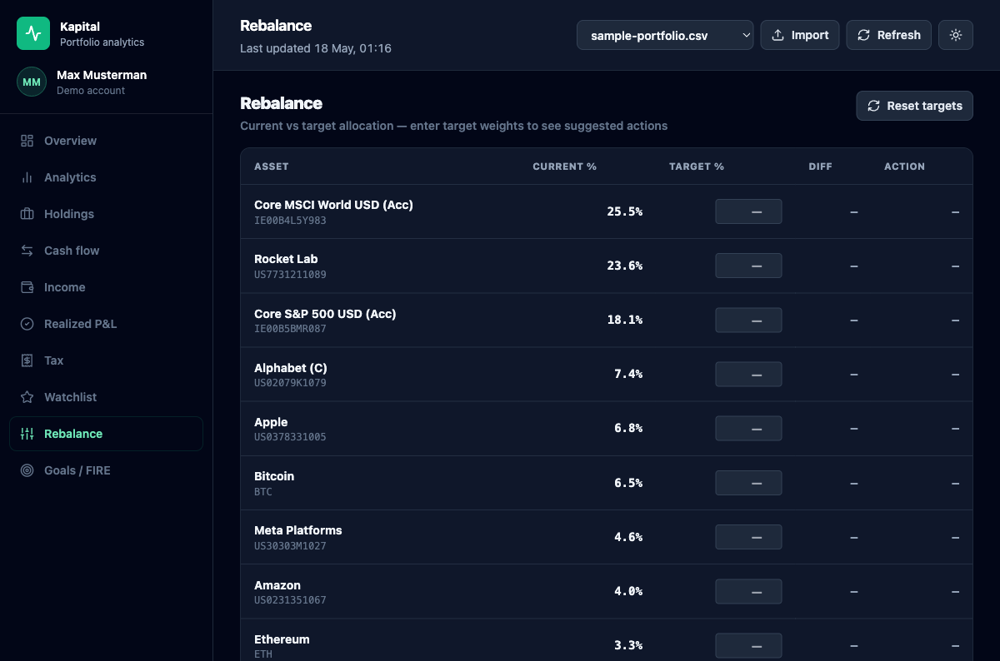
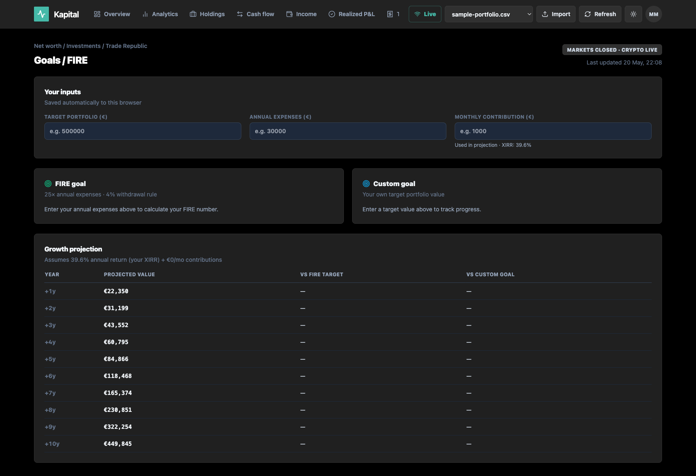

# Kapital — Portfolio Analytics Dashboard

A self-hosted portfolio dashboard for Trade Republic CSV exports. Tracks holdings, performance, income, tax, and more in a clean React UI backed by a FastAPI data engine.

> **Demo data included** — the repo ships with a synthetic `exports/sample-portfolio.csv` so you can run it without connecting real account data.

---

## Screenshots

### Overview — portfolio value, returns, rolling performance


### Analytics — monthly returns heatmap, Sharpe, drawdown


### Holdings — positions with avg cost, market value, unrealized P&L


### Cash flow — balance history and inflow/outflow waterfall


### Income — dividends, interest, stock perks log


### Realized P&L — closed trades with per-trade gain/loss


### Tax — Vorabpauschale, withholding, FSA tracker


### Rebalance — target weights with buy/sell actions


### Goals / FIRE — FIRE calculator and 10-year projection


---

## Tech stack

| Layer | Tech |
|---|---|
| Backend | Python 3.12 · FastAPI · pandas · yfinance · SQLite |
| Frontend | React 19 · TypeScript · Vite · Tailwind CSS · Recharts |
| Package mgmt | uv (Python) · npm (Node) |

---

## Run locally

**Prerequisites:** Python 3.12+, Node 20+, [uv](https://docs.astral.sh/uv/)

```bash
# Install dependencies
npm install
uv sync

# Build the frontend
npm run build

# Start the server
uv run uvicorn api:app --port 8765
```

Open **http://127.0.0.1:8765** — the sample portfolio loads automatically.

---

## Run with Docker (HTTP + HTTPS)

**Prerequisites:** [Docker](https://docs.docker.com/get-docker/) with Compose

```bash
docker compose up --build
```

| URL | What |
|---|---|
| `http://localhost` | Redirects to HTTPS automatically |
| `https://localhost` | App with self-signed TLS cert |

The Nginx image generates a self-signed certificate for `localhost` at build time.
Your browser will show a security warning on first visit — click **Advanced → Proceed** to accept it.

To use a real domain with an auto-provisioned Let's Encrypt cert, change the `server_name` in `nginx/nginx.conf` and remove the `ssl_certificate`/`ssl_certificate_key` directives — Nginx + Certbot handles the rest.

**Volumes:**

| Mount | Purpose |
|---|---|
| `./exports` | Drop CSV exports here; survives container restarts |
| `kapital-db` (named) | SQLite watchlist — persisted across restarts |

---

## Import your own data

1. In the Trade Republic app: **Profile → Documents → Transaction history → Export**
2. Drop the CSV into `exports/`, or use the **Import** button in the dashboard header
3. The newest export is selected by default; older exports stay available in the file selector

---

## Features

| Tab | What it shows |
|---|---|
| **Overview** | Portfolio value, TWR, XIRR, Sharpe ratio, rolling returns, performance chart, top movers |
| **Analytics** | Monthly returns heatmap, annual P&L, allocation treemap, geographic exposure |
| **Holdings** | Current positions — shares, avg cost, market value, unrealized P&L, TTM yield |
| **Cash flow** | Cash balance area chart + inflow/outflow waterfall |
| **Income** | Dividends, interest, stock perks log + dividend calendar |
| **Realized P&L** | Closed trades with per-trade gain/loss |
| **Tax** | Vorabpauschale, withholding tax, capital gains · FSA (Freistellungsauftrag) tracker |
| **Watchlist** | Track assets with target prices — persisted in SQLite |
| **Rebalance** | Enter target weights, see buy/sell amounts needed |
| **Goals / FIRE** | FIRE number calculator, custom goal tracker, 10-year projection |

Click any holding to open a per-asset modal with full transaction history and position notes.

---

## Adding an unlisted asset

If the dashboard can't find a price for an ISIN it shows a warning in the Holdings tab.

- **Auto-discovery** — the app queries Yahoo Finance automatically; new mappings are cached to `cache/isin_to_ticker.json`
- **Manual override** — add the ISIN → ticker pair to `KNOWN_TICKERS` in `portfolio/prices.py`

USD-denominated tickers are FX-converted to EUR automatically via `USDEUR=X`.

---

## Project layout

```
├── api.py                    # FastAPI entry point (~20 lines)
├── app/
│   ├── deps.py               # Shared state cache + helpers
│   ├── schemas.py            # Pydantic response models
│   └── routers/
│       ├── core.py           # SPA index, export listing, CSV upload
│       ├── portfolio.py      # Summary, holdings, performance, income…
│       ├── analytics.py      # Analytics, geographic exposure, FSA, dividends
│       └── watchlist.py      # Watchlist CRUD
├── portfolio/                # Pure data layer (no HTTP concerns)
│   ├── loader.py             # CSV → DataFrame
│   ├── positions.py          # Holdings & realized P&L (avg-cost basis)
│   ├── cash.py               # Cash flow & income
│   ├── prices.py             # Live prices via yfinance, FX-adjusted
│   ├── performance.py        # Daily portfolio value vs contributions
│   ├── returns.py            # TWR, XIRR, Sharpe, drawdown
│   ├── benchmark.py          # Benchmark comparison
│   └── db.py                 # SQLite persistence (watchlist)
├── src/                      # React + TypeScript frontend
│   ├── App.tsx               # Root: state, layout, tab routing
│   ├── lib/                  # Pure utilities (format, chart theme, sections)
│   └── components/
│       ├── ui/               # Card, MetricCard, ProgressBar, Skeleton…
│       ├── charts/           # HeroChart, AllocationTreemap
│       └── views/            # One file per tab
├── index.html                # Vite entry point
└── exports/                  # Drop CSV exports here
```
